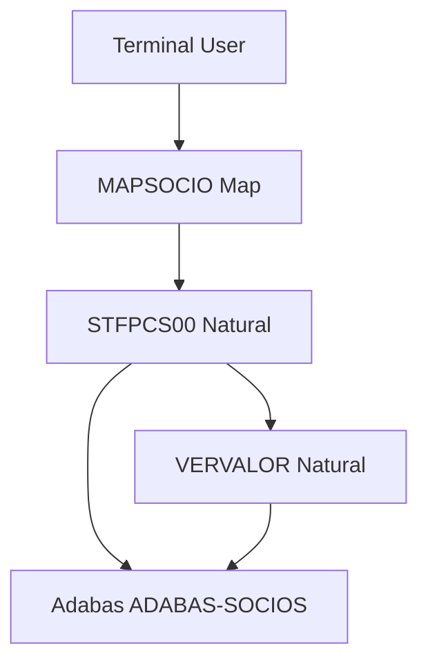
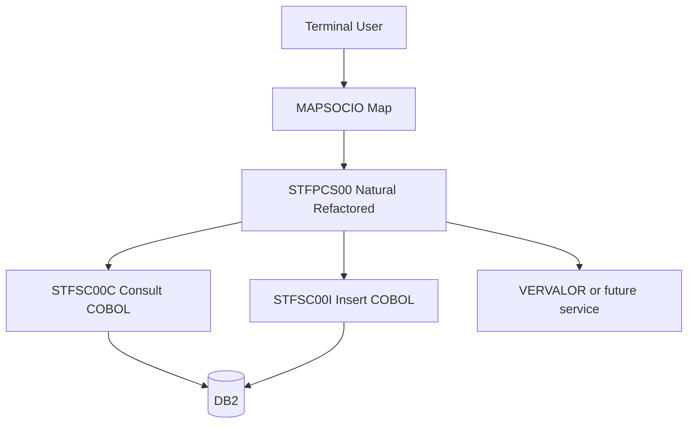

# Mainframe Modernization Overview

**Version:** 2026-05-20

**Purpose:**  
Single source of truth for modernizing Natural/Adabas member-management programs into a COBOL/DB2 service-oriented architecture (Stefanini P2 sample).

---

# Platform Statistics

| Metric | Value |
|--------|-------|
| Source technology | Natural + Adabas |
| Target persistence | COBOL + DB2 |
| Processing model | Online dialog (map-driven); batch not present in repo |
| Mainframe environment | z/OS (assumed) |
| Integration style | Natural → COBOL service programs via shared copybook/LDA |
| Database strategy | Adabas `ADABAS-SOCIOS` → normalized DB2 tables |
| Natural programs inventoried | 1 (`STFPCS00`) |
| Adabas DDMs inventoried | 1 (`ADABAS-SOCIOS`) |
| External CALLNAT | 1 (`VERVALOR`, not in repo) |

**Source folder:** `prg-natural-p2/` (no `natural-prg/` directory in this repository).

---

# High-Level Architecture

## Current State

Natural program `STFPCS00` reads and writes the `SOCIO` view on Adabas file `ADABAS-SOCIOS`. Fee amounts are resolved by subprogram `VERVALOR`.

## Target State

Persistence moves to COBOL services; Natural retains presentation, validation orchestration, and CALLNAT to non-persistence helpers where applicable.

---

# Modernization Strategy

## Phase 1 — Discovery (Complete for sample scope)

- Inventory Natural programs in `prg-natural-p2/`
- Map Adabas DDM and view usage
- Extract business rules from `STFPCS00`
- Identify transaction boundary: single dialog session, FIND then optional STORE

## Phase 2 — Service Encapsulation

- Create `STFSC00C` (consult by RG) for `FIND`
- Create `STFSC00I` (inclusion) for `STORE` including child payment rows
- Define shared COBOL copybook + Natural LOCAL equivalent (`I`/`C` operations only per source)

## Phase 3 — Natural Refactoring

- Replace `FIND` / `STORE` with COBOL calls using LDA
- Comment legacy Adabas access points
- Map return codes: SQLCODE +100 (not found), +803 (duplicate), +000 (success)

## Phase 4 — Adabas Retirement

- Remove `VIEW OF ADABAS-SOCIOS` from DEFINE DATA
- Retire DDM dependency after parallel validation
- Keep `VERVALOR` integration path documented

---

# Module Catalog

<!-- MODULE_LIST_START -->

**Modules:** socio

<!-- MODULE_LIST_END -->

## Socio Module

### Current Programs

| Program | Role |
|---------|------|
| STFPCS00 | Online new-member registration |
| VERVALOR | Category-based monthly fee lookup (external) |

### Current Adabas Usage

| Operation | Context |
|-----------|---------|
| FIND | Check duplicate RG (`NUMB-SOCIO-PRINCIPAL`) |
| STORE | Persist new member after validations |

### Target COBOL Services

| Service | Operation |
|---------|-----------|
| STFSC00C | Consult member by RG |
| STFSC00I | Insert member + periodic payment rows |

### Target DB2 Tables

| Table | Purpose |
|-------|---------|
| TB_SOCIO | Member master |
| TB_SOCIO_PERIODICO_PAGAMENTO | Payment due dates, amounts, paid flags (1:N, no PE flatten) |

### Business Rules (extracted from Natural)

1. **Exit:** PF-KEY `F3` ends program after message.
2. **Navigation:** Only `ENTR` accepted; otherwise full reinput.
3. **RG required:** `#RG-CONSULTA` must be non-zero.
4. **Duplicate check:** FIND by RG; if record exists → *"Sócio já cadastrado."*
5. **Name:** `NOME-SOCIO-PRINCIPAL` cannot be blank on insert path.
6. **Category:** `CATG-SOCIO` must be `1` (Principal) or `2` (Dependente); `0` rejected.
7. **Due day:** `#DIA-VENCIAMENTO` must be one of `1`, `5`, `15`, `20`, `25`.
8. **Registration date:** `DATA-CADASTRO := *DATX`.
9. **Fees:** `CALLNAT 'VERVALOR'` fills `VALR-MENSALIDADE(*)` from category.
10. **First payment:** `PAGAMENTO-OK(1) := TRUE`; positions 2–11 `FALSE`.
11. **Schedule:** Loop 1–12 sets `DATA-VENCIMENTO` advancing month/year from due day anchor.
12. **Defaults:** `INDI-DIVIDA`, `DATA-BAIXA`, `HORA-BAIXA` reset; empty observation → *"Novo sócio"*.
13. **Success message:** *"Novo sócio incluído com sucesso."* after STORE.
14. **Errors:** `ON ERROR` compresses `*ERROR` and `*ERROR-LINE` into reinput text.

---

# Natural to COBOL Integration Strategy

## Integration Model

Natural will:

- Populate LDA mirroring COBOL linkage (action code `C` or `I`)
- Invoke COBOL (`CALL` or site-standard bridge)
- Interpret standardized return code (+000, +100, +803, others generic)
- Retain map logic, PF-KEY handling, and `REINPUT` messaging

COBOL will:

- Execute DB2 SQL for consult/insert
- Insert parent row then child payment rows in one logical unit of work
- Convert Natural `D` dates to `YYYY-MM-DD` host variables via `MOVE EDITED`
- Commit/rollback per service design (single STORE → single commit recommended)

## Operations Generated (source-driven)

| Adabas in source | COBOL generated |
|------------------|-----------------|
| FIND | STFSC00C only |
| STORE | STFSC00I only |
| UPDATE | Not generated |
| DELETE | Not generated |

---

# Adabas Dependency Inventory

| Natural Program | Adabas File / View | Operation | Key / Fields | Target COBOL |
|-----------------|-------------------|-----------|--------------|--------------|
| STFPCS00 | ADABAS-SOCIOS / SOCIO | FIND | `NUMB-SOCIO-PRINCIPAL` | STFSC00C |
| STFPCS00 | ADABAS-SOCIOS / SOCIO | STORE | Full view after validation | STFSC00I |

### DDM Field Summary (`ADABAS-SOCIOS`)

| Field | Type | Business meaning |
|-------|------|------------------|
| NUMB-SOCIO-PRINCIPAL | N9 | Member RG (principal id) |
| NOME-SOCIO-PRINCIPAL | A40 | Full name |
| DATA-CADASTRO | D | Registration date |
| PERIODICO-PAGAMENTO (PE) | Group | Due date, fee, paid flag per period |
| CATG-SOCIO | I2 | 1=Principal, 2=Dependente |
| INDI-DIVIDA | L | TRUE=overdue |
| DATA-BAIXA / HORA-BAIXA | D / T | Contract end |
| OBSV-SOCIO | A500 | Notes (program field `OBSV-CLIENTE`) |
| SUPER1 | Descriptor | `CATG-SOCIO` + `INDI-DIVIDA` — index only in DB2 |

---

# DB2 Target Strategy

## Modeling rules

- Periodic group `PERIODICO-PAGAMENTO` → table `TB_SOCIO_PERIODICO_PAGAMENTO` (1:N).
- Do **not** flatten 12 occurrences into `VALR_MENSALIDADE_01` … `_12`.
- `SUPER1` not migrated as a column; use composite index on category + debt indicator.
- Date columns: `DATE` with ISO format; time `HORA_BAIXA` as `TIME` or `CHAR(8)` per site standard.

## Suggested keys

- `TB_SOCIO`: PK `NUMB_SOCIO_PRINCIPAL`
- `TB_SOCIO_PERIODICO_PAGAMENTO`: PK surrogate + FK to `TB_SOCIO`, sequence or due-date uniqueness

## Transaction boundaries

| Flow | Boundary |
|------|----------|
| Duplicate check | `STFSC00C` read-only |
| New member | `STFSC00I` inserts header + up to 12 payment rows in one service call |

---

# Business Rules by Module

## Socio Module

### Rule: Duplicate prevention

Before insert, consult by RG; existing record blocks registration with user message.

### Rule: Payment calendar

Twelve monthly due dates generated from user-selected day-of-month; first installment marked paid.

### Rule: Category-driven pricing

Monthly amounts not entered on screen; delegated to `VERVALOR` by `CATG-SOCIO`.

---

# COBOL/DB2 Standards

## COBOL service standards

- One responsibility per program (`STFSC00C` vs `STFSC00I`)
- Procedure division: `INICIALIZA` → `PROCESSA` → `FINALIZA` → `STOP RUN`
- `WORKING-STORAGE`: constants only; SQL/cursors/books in `LOCAL-STORAGE`
- Return code in shared copybook aligned to DB2 SQLCODE

## DB2 standards

- Explicit `COMMIT` in inclusion service after successful child inserts
- Cursor required for multi-row repetitive reads (consult path if returning history)
- Package/bind governance per environment

---

# Performance Considerations

- Consolidate consult + insert decision in Natural to avoid redundant `STFSC00C` after failed validation
- Child table inserts: batch 12 rows in single COBOL service vs 12 Natural calls
- Index on `(NUMB_SOCIO_PRINCIPAL)` and periodic `(NUMB_SOCIO_PRINCIPAL, DATA_VENCIMENTO)`

---

# Technical Risks

| Risk | Mitigation |
|------|------------|
| Field name mismatch (`OBSV-CLIENTE` vs `OBSV-SOCIO`) | Align copybook/LDA with DDM canonical names |
| `VERVALOR` still on Adabas | Phase 2: migrate fee lookup or document dependency |
| PE → relational row count vs Natural fixed 12 | Accept 12 rows on insert; schema allows unlimited for future |
| Date format Natural `D` vs DB2 `DATE` | `MOVE EDITED` with `YYYY-MM-DD` in COBOL bridge |
| Map `MAPSOCIO` not in repo | Obtain map definition before UI regression test |

---

# Success Metrics

- Zero direct Adabas access from `STFPCS00`
- `STFSC00C` / `STFSC00I` pass integration tests with equivalent outcomes
- DB2 child table models all periodic payment attributes without flattening
- User stories traceable to rules in this document and module page

---

# Migration Roadmap (Activity)

| Date | Activity |
|------|----------|
| 2026-05-20 | Discovery documentation from `prg-natural-p2` sources |
| Pending | DB2 DDL in `DB2/` folder |
| Pending | COBOL programs in `Cobol/` |
| Pending | Natural refactor with commented Adabas blocks |

Last updated: 2026-05-20
