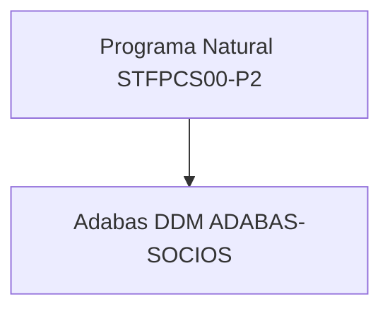
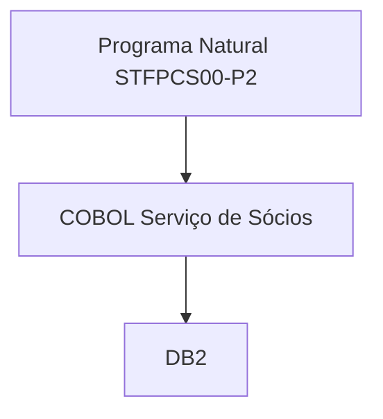

# Visão Geral da Modernização

**Versão:** 2026-05-21  
**Propósito:**  
Documento-base para modernização de Natural/Adabas para uma arquitetura com Natural orquestrando serviços COBOL/DB2.

---

# Estatísticas da Plataforma

- Tecnologia de origem: Natural + Adabas
- Persistência alvo: COBOL + DB2
- Modelo de processamento: online de mainframe
- Ambiente alvo: z/OS
- Estilo de integração: Natural chamando programa COBOL de serviço
- Estratégia de migração: Adabas → DB2 com encapsulamento progressivo

---

# Arquitetura de Alto Nível

## Estado Atual

O programa Natural acessa o Adabas diretamente para localizar e incluir sócios.

## Estado Alvo

O programa Natural passa a delegar persistência para um serviço COBOL responsável pelo DB2.

---

# Estratégia de Modernização

## Fase 1 - Descoberta

- Inventariar programas Natural
- Mapear uso de Adabas
- Extrair regras de negócio
- Identificar limites de transação

## Fase 2 - Encapsulamento de Serviço

- Criar programa COBOL para inclusão/consulta de sócios
- Definir book de comunicação Natural x COBOL
- Definir estruturas de host variables e SQL

## Fase 3 - Refatoração Natural

- Remover acesso direto ao Adabas
- Substituir `FIND` e `STORE` por chamadas ao COBOL
- Padronizar tratamento de retorno +000, +100 e +803

## Fase 4 - Retirada do Adabas

- Eliminar dependência direta do DDM
- Consolidar DB2 como persistência autorizada
- Simplificar o programa Natural para orquestração

---

# Catálogo de Módulos

**Módulos identificados:** socios

## Módulo de Sócios

### Programas atuais

- `STFPCS00-P2`

### Dependência Adabas atual

- `ADABAS-SOCIOS`

### Operações observadas

- `FIND SOCIO WITH NUMB-SOCIO-PRINCIPAL EQ #RG-CONSULTA`
- `STORE`

### Regras de negócio observadas

- RG do sócio deve ser informado
- RG já cadastrado impede inclusão
- Nome do sócio deve ser informado
- Categoria deve ser válida
- Dia de vencimento deve pertencer ao conjunto permitido
- O novo sócio já entra com a primeira mensalidade paga
- Mensalidades futuras são inicializadas com base na data atual

### Serviços COBOL candidatos

- `STFSC00I` para inclusão
- `STFSC00C` para consulta

### Entidades DB2 candidatas

- `TB_SOCIO`
- `TB_SOCIO_PERIODICO`

---

# Integração Natural com COBOL

## Modelo de integração

Natural deve:

- Montar área de parâmetros
- Chamar serviço COBOL
- Tratar retorno funcional e mensagens
- Concentrar a lógica de apresentação

COBOL deve:

- Executar SQL no DB2
- Validar regras de persistência
- Controlar commit/rollback
- Retornar código padronizado

## Convenção de retorno

- `+000`: registro localizado ou operação concluída
- `+100`: registro não localizado
- `+803`: erro de inserção por chave duplicada
- outros retornos: tratamento genérico

---

# Inventário de Dependências Adabas

| Programa Natural | Arquivo Adabas | Operação | Serviço COBOL alvo |
| --- | --- | --- | --- |
| STFPCS00-P2 | ADABAS-SOCIOS | FIND | STFSC00C |
| STFPCS00-P2 | ADABAS-SOCIOS | STORE | STFSC00I |

---

# Regras de Negócio Extraídas

1. A inclusão é iniciada pela consulta do RG do sócio.
2. Se o RG já existir, o processo bloqueia a nova inclusão.
3. Se o nome estiver em branco, a operação é rejeitada.
4. Categoria só aceita os valores 1 e 2.
5. O dia de vencimento aceito é 1, 5, 15, 20 ou 25.
6. A data de cadastro recebe a data corrente.
7. O primeiro pagamento é marcado como pago.
8. Os vencimentos mensais são gerados para 12 competências.
9. Se não houver observação, a descrição padrão é `Novo sócio`.

---

# Estratégia DB2

## Diretrizes

- Migrar a persistência para tabelas DB2 compatíveis com o modelo funcional do Adabas
- Preservar a hierarquia funcional do grupo periódico
- Mapear campos de data para formato `YYYY-MM-DD`
- Manter tratamento explícito de retorno SQLCODE

## Considerações de modelagem

- `NUMB-SOCIO-PRINCIPAL` tende a ser chave natural do cadastro
- `PERIODICO-PAGAMENTO` deve virar estrutura relacional própria
- `SUPER1` deve ser analisado como derivação funcional, não como coluna física sem necessidade

---

# Sequenciamento de Migração

1. Criar book de comunicação Natural x COBOL
2. Criar serviço COBOL de inclusão
3. Criar serviço COBOL de consulta
4. Redirecionar o Natural para o serviço COBOL
5. Validar equivalência funcional
6. Desativar acesso direto ao Adabas

---

# Riscos Técnicos

## Risco 1

Regras de negócio embutidas em validações de tela podem ser perdidas na migração.

Mitigação:

- validação funcional com SME
- comparação de comportamento entre origem e alvo

## Risco 2

A estrutura `PERIODICO-PAGAMENTO` pode exigir decomposição relacional cuidadosa no DB2.

Mitigação:

- modelagem explícita de entidade filha
- testes de atualização e consistência

## Risco 3

O tratamento de retorno de DB2 pode divergir do comportamento esperado no Natural.

Mitigação:

- padronizar `SQLCODE` e retorno funcional
- documentar mensagens e códigos

---

# Métricas de Sucesso

- 100% do acesso direto ao Adabas removido do fluxo alvo
- Serviço COBOL executando a persistência em DB2
- Regras críticas preservadas
- Documentação suficiente para criação de User Stories

Última atualização: 2026-05-21
