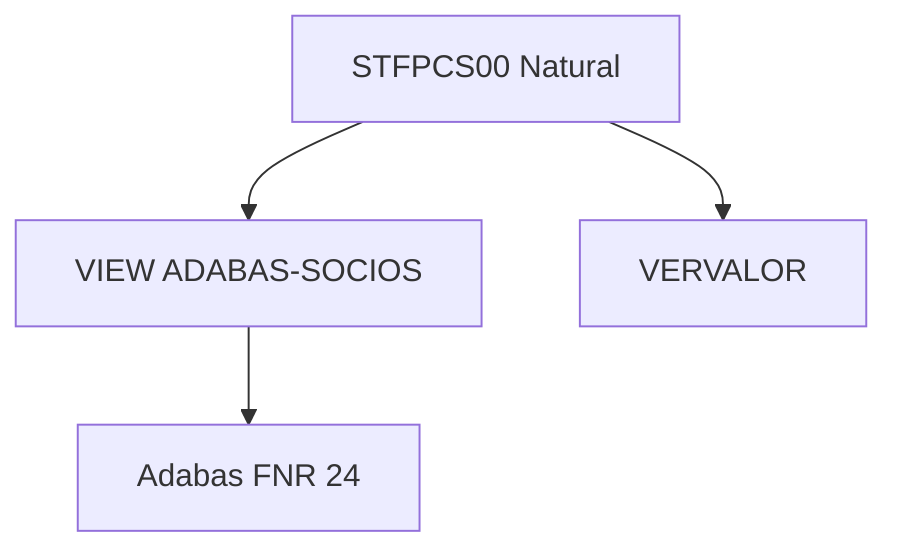
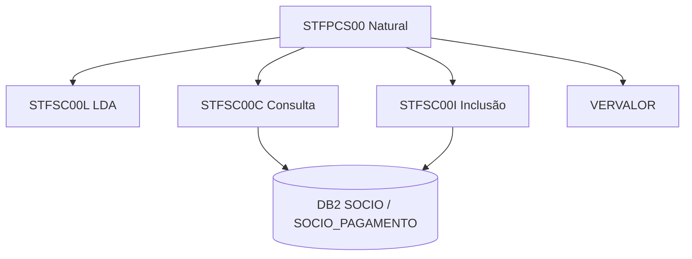
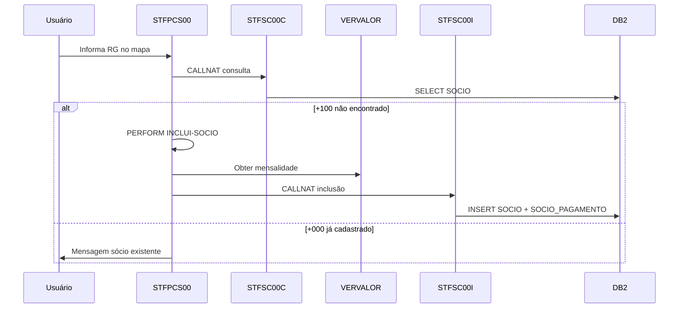

# Visão Geral da Modernização Mainframe

**Versão:** 2026-05-21

**Propósito:**  
Fonte única de verdade para a modernização de aplicações Natural/Adabas para arquitetura orientada a serviços COBOL/DB2 no projeto P2 (Gestão de Sócios).

---

# 📊 Estatísticas da Plataforma

- **Tecnologia origem:** Natural + Adabas
- **Camada alvo de persistência:** COBOL + DB2
- **Modelo de processamento:** Online (transação com mapa)
- **Ambiente mainframe:** z/OS (presumido)
- **Estilo de integração:** Natural invocando subprogramas COBOL via CALLNAT
- **Estratégia de banco:** Adabas FNR 24 (`ADABAS-SOCIOS`) → DB2 (`SOCIO`, `SOCIO_PAGAMENTO`)
- **Programas Natural inventariados:** 1
- **Serviços COBOL implementados:** 2 (consulta e inclusão)
- **Pasta fonte:** `prg-natural-p2/`

---

# 🏗️ Arquitetura de Alto Nível

## Estado Atual (legado documentado)

Os programas Natural acessavam diretamente o arquivo Adabas `ADABAS-SOCIOS` (DDM FNR 24).

## Estado Alvo (em implementação)

O programa Natural delega persistência aos serviços COBOL; COBOL executa SQL em DB2.

## Estado Implementado no Repositório

O programa `STFPCS00-P2.txt` já substituiu FIND e STORE por `CALLNAT` aos serviços COBOL. Os acessos Adabas originais permanecem comentados no fonte para rastreabilidade.

---

# 🎯 Estratégia de Modernização

## Fase 1 — Descoberta ✅

- Inventário de programas em `prg-natural-p2/`
- Mapeamento do DDM `ADABAS-SOCIOS-P2.txt`
- Identificação de operações: FIND (consulta), STORE (inclusão)
- Extração de regras de negócio do subprograma `INCLUI-SOCIO`

## Fase 2 — Encapsulamento de Serviços ✅ (parcial)

- Copybook `STFSC00B` (comunicação)
- LDA Natural `STFSC00L` (equivalente funcional)
- `STFSC00C` — consulta por RG (`NUMB_SOCIO_PRINCIPAL`)
- `STFSC00I` — inclusão de sócio e 12 pagamentos
- DDL DB2 `DDL_SOCIO.sql`

## Fase 3 — Refatoração Natural ✅ (parcial)

- Remoção de VIEW Adabas; uso de `LOCAL USING STFSC00L`
- Chamadas `CALLNAT 'STFSC00C'` e `CALLNAT 'STFSC00I'`
- Tratamento de return codes alinhado ao SQLCODE DB2

## Fase 4 — Retirada Adabas ⏳ Pendente

- Validar paridade funcional em ambiente integrado
- Descomissionar dependência do arquivo FNR 24
- Migrar ou documentar subprograma `VERVALOR`

---

# 📚 Catálogo de Módulos

<!-- MODULE_LIST_START -->

**Módulos:** socio

<!-- MODULE_LIST_END -->

## Módulo Socio

### Programas Atuais

- **STFPCS00** — Inclusão de novo sócio via mapa `MAPSOCIO`

### Uso Adabas (legado)

| Operação | Contexto | Chave |
|----------|----------|-------|
| FIND | Verificar existência antes da inclusão | `NUMB-SOCIO-PRINCIPAL` = RG informado |
| STORE | Gravar novo sócio e PE de pagamentos | Após validações em `INCLUI-SOCIO` |

### Serviços COBOL Alvo

| Programa | Responsabilidade |
|----------|------------------|
| STFSC00C | SELECT em `SOCIO`; cursor em `SOCIO_PAGAMENTO` |
| STFSC00I | INSERT em `SOCIO` e `SOCIO_PAGAMENTO` (até 12 parcelas) |

### Tabelas DB2

| Tabela | Descrição |
|--------|-----------|
| `SOCIO` | Dados cadastrais do sócio |
| `SOCIO_PAGAMENTO` | Pagamentos periódicos (ex-PE `PERIODICO-PAGAMENTO`) |

### Regras de Negócio Extraídas

1. **RG obrigatório** — `#RG-CONSULTA` não pode ser zero.
2. **Consulta prévia** — FIND legado / `STFSC00C`: `+100` indica sócio inexistente e habilita fluxo de inclusão; `+000` indica já cadastrado.
3. **Nome obrigatório** — `NOME-SOCIO-PRINCIPAL` não pode ser em branco na inclusão.
4. **Categoria válida** — `CATG-SOCIO` deve ser 1 (Principal) ou 2 (Dependente); 0 e outros valores rejeitados.
5. **Dia de vencimento** — Apenas dias 1, 5, 15, 20 ou 25 são aceitos.
6. **Data de cadastro** — Preenchida com data corrente (`*DATX`) no formato `YYYY-MM-DD`.
7. **Mensalidades** — Valores obtidos via `CALLNAT 'VERVALOR'` por categoria; 12 parcelas geradas em loop mensal.
8. **Primeira parcela paga** — `PAGAMENTO-OK(1) = TRUE`; demais `FALSE` na inclusão.
9. **Indicador de dívida** — Inicializado em branco/falso (`RESET INDI-DIVIDA`).
10. **Observação padrão** — Se vazio, grava `'Novo sócio'`.
11. **Chave duplicada** — Return code `+803` na inclusão mapeado de SQLCODE -803.
12. **Teclas PF** — F3 encerra; apenas ENTR aceita para consulta.

---

# 🔄 Estratégia de Integração Natural → COBOL

## Modelo de Integração

1. Natural declara `LOCAL USING STFSC00L` (espelho do copybook `STFSC00B`).
2. Natural popula campos de entrada (ex.: `STFSC00L-NUMB-SOCIO-PRINCIPAL`).
3. `CALLNAT 'STFSC00C' STFSC00L` ou `CALLNAT 'STFSC00I' STFSC00L`.
4. Natural avalia `STFSC00L-RETURN-CODE` e apresenta mensagem ao usuário.

## Responsabilidades

| Camada | Responsabilidade |
|--------|------------------|
| Natural | Apresentação (mapa), validações de tela, orquestração, cálculo de datas de vencimento |
| COBOL | SQL DB2, conversão de tipos (Lógico → CHAR Y/N), cursor para pagamentos, SQLCODE → return code |
| DB2 | Persistência relacional, integridade referencial, índice composto SUPER1 |

## Return Codes Padronizados

| Código | Significado | Origem DB2 |
|--------|-------------|------------|
| +000 | Sucesso / registro encontrado | SQLCODE 0 |
| +100 | Registro não encontrado | SQLCODE 100 |
| +803 | Chave duplicada na inclusão | SQLCODE -803 |
| +999 | Erro genérico | Demais SQLCODE |

---

# 📊 Inventário de Dependências Adabas

| Programa Natural | Arquivo Adabas | Operação | Serviço COBOL | Status |
|------------------|----------------|----------|---------------|--------|
| STFPCS00 | ADABAS-SOCIOS (FNR 24) | FIND | STFSC00C | ✅ Implementado |
| STFPCS00 | ADABAS-SOCIOS (FNR 24) | STORE | STFSC00I | ✅ Implementado |
| STFPCS00 | — | — | VERVALOR | ⚠️ Externo ao repositório |

---

# 📋 Regras de Negócio por Módulo

## Módulo Socio — Fluxo de Inclusão

---

# ⚙️ Padrões COBOL/DB2

## Padrões de Serviço COBOL

- Nomenclatura: `STF` + `S` + `C` + `00` + `{I|C|A|E}`
- Estrutura obrigatória: `INICIALIZA` → `PROCESSA` → `FINALIZA` → `STOP RUN`
- WORKING-STORAGE: apenas constantes e declaração de cursores
- LOCAL-STORAGE: SQLCA, copybooks, host variables
- Cursores nomeados pela tabela: `CSR-SOCIO-PAG`, perform `CARREGA-SOCIO-PAG-CURSOR`
- Sem flatten do PE: tabela filha `SOCIO_PAGAMENTO` com PK `(NUMB_SOCIO_PRINCIPAL, SEQ_PAGAMENTO)`

## Padrões DB2

- Datas em formato ISO `YYYY-MM-DD` na interface Natural/COBOL
- SUPER1 Adabas convertido em índice `IX_SOCIO_SUPER1 (CATG_SOCIO, INDI_DIVIDA)`
- COMMIT implícito por transação CICS/online (a confirmar no ambiente)
- Campos lógicos Natural (`L`) convertidos para `CHAR(1)` Y/N no DB2

---

# ⚡ Considerações de Performance

- Uma chamada COBOL por consulta e uma por inclusão — aceitável para transação online unitária.
- Cursor em `SOCIO_PAGAMENTO` limitado a 12 ocorrências no programa de consulta (`WS-CONST-MAX-PAGAMENTOS`).
- Evitar chamadas redundantes a `STFSC00C` após falha de validação de tela.
- Índice `IX_SOCIO_PAG_VENC` suporta consultas por vencimento futuras.

---

# 🚨 Riscos Técnicos

## Risco 1 — Subprograma VERVALOR não versionado

**Descrição:** Tarifas de mensalidade dependem de programa externo não presente no repositório.  
**Mitigação:** Inventariar VERVALOR; definir se permanece Natural ou migra para serviço COBOL/parâmetro DB2.

## Risco 2 — Semântica de transação Adabas vs DB2

**Descrição:** STORE Adabas gravava registro e PE atomicamente; DB2 usa dois INSERTs sem rollback explícito no COBOL analisado.  
**Mitigação:** Implementar unidade de trabalho com ROLLBACK em falha parcial na inclusão de pagamentos.

## Risco 3 — Operações de alteração e baixa ausentes

**Descrição:** Apenas consulta e inclusão foram geradas; fluxos futuros de UPDATE/DELETE exigirão STFSC00A/STFSC00E.  
**Mitigação:** Gerar serviços somente quando operações forem identificadas no fonte Natural expandido.

## Risco 4 — Paridade de tipos de data

**Descrição:** Adabas usava tipo `D` (6 posições); interface usa `A10` com máscara `YYYY-MM-DD`.  
**Mitigação:** Testes de regressão com datas limite e campos nulos (`DATA_BAIXA`, `HORA_BAIXA`).

---

# 📈 Métricas de Sucesso

- [ ] 100% de remoção de acesso direto Adabas em `STFPCS00`
- [x] Serviços COBOL de consulta e inclusão operacionais
- [x] Modelo DB2 normalizado para PE de pagamentos
- [ ] Cobertura de testes de paridade Adabas/DB2
- [ ] Documentação de VERVALOR e mapas dependentes

---

# 📂 Estrutura de Documentação

| Documento | Caminho |
|-----------|---------|
| Dashboard | `docs/site/index.html` |
| Visão geral | `docs/system-overview.md` |
| Mapa de arquivos | `docs/module-file-map.md` |
| Módulo Sócio | `docs/site/modules/socio/index.html` |

---

*Última atualização: 2026-05-21*
